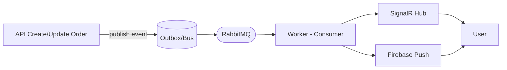

# Order Signal

<!-- Badges -->


**Order Signal** is a showcase project demonstrating a modern event-driven backend in **.NET 8**.  
Scope of the MVP: create an order, update its status, publish an event, process it in a worker, and notify the user in real time (SignalR + Firebase).

> This is a study/portfolio project, not a production system.


## Tech Stack (MVP)
- .NET 8 (ASP.NET Core, Background services)
- MassTransit + RabbitMQ (event-driven, outbox)
- EF Core + PostgreSQL (persistence) — provider TBD in the MVP
- SignalR (real-time updates), Firebase Cloud Messaging (push)
- Testing: xUnit (unit), Testcontainers (integration) — later


## Repository Structure

```text
order-signal/
├─ src/
│  ├─ OrderSignal.Api/
│  │  ├─ OrderSignal.Api.csproj
│  │  ├─ Program.cs
│  │  └─ (Controllers/, Hubs/, etc.)
│  ├─ OrderSignal.Worker/
│  │  ├─ OrderSignal.Worker.csproj
│  │  └─ Program.cs
│  └─ OrderSignal.Contracts/
│     └─ OrderSignal.Contracts.csproj
├─ tests/
│  └─ OrderSignal.Unit/
│     └─ OrderSignal.Unit.csproj
├─ docs/
│  ├─ roadmap.md
│  └─ adr/
├─ .gitignore
├─ order-signal.sln
└─ README.md
```

## Current Status
- ✅ Repo scaffold created
- 🟡 Implementing MVP (see [docs/roadmap.md](./docs/roadmap.md))
- ⏭️ Next: add MassTransit + Outbox, publish events from API, basic consumer

➡️ Project board: [Order Signal showcase](https://github.com/<user>/order-signal/projects/<id>)

## Quickstart (WIP)
For now, run the projects locally:

```bash
# API
dotnet run --project src/OrderSignal.Api/OrderSignal.Api.csproj

# Worker
dotnet run --project src/OrderSignal.Worker/OrderSignal.Worker.csproj

# Docker Compose (Postgres + RabbitMQ) will be added soon.
```

## Architecture (high level)


---

## Events (planned)

- `OrderCreated { OrderId, UserId, OccurredAt }`
- `OrderStatusChanged { OrderId, UserId, Status, OccurredAt }`

**Headers (planned):**
- `correlationId`
- `causationId`
- `eventType`
- `eventVersion`

---

## Roadmap

- [ ] Setup Docker Compose (Postgres + RabbitMQ) — [#3](https://github.com/VirginioBruno/order-signal/issues/3)
- [ ] Implement API routes: create/update orders — [#2](https://github.com/VirginioBruno/order-signal/issues/2), [#6](https://github.com/VirginioBruno/order-signal/issues/6)
- [ ] Add MassTransit with Outbox pattern — [#4](https://github.com/VirginioBruno/order-signal/issues/4)
- [ ] Worker consumes events and logs — [#5](https://github.com/VirginioBruno/order-signal/issues/5)
- [ ] Add SignalR hub + demo page — [#8](https://github.com/VirginioBruno/order-signal/issues/8)
- [ ] Register device token endpoint — [#9](https://github.com/VirginioBruno/order-signal/issues/9)
- [ ] Firebase push notifications — [#7](https://github.com/VirginioBruno/order-signal/issues/7)
- [ ] Initial documentation — [#10](https://github.com/VirginioBruno/order-signal/issues/10)

➡️ More details in [docs/roadmap.md](./docs/roadmap.md).